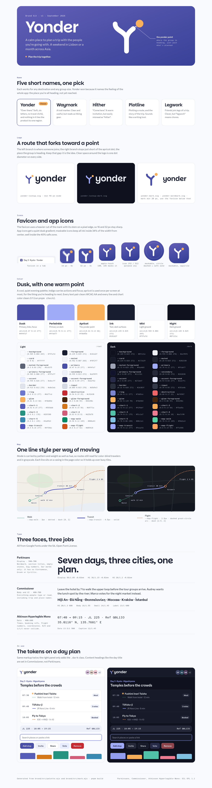

# Yonder brand kit

Yonder is a calm, shared place to plan a trip with the people you're going with, for any destination and any group size. This folder holds the logo, icons, color tokens and type for the trip-planner app, plus the scripts that generate them.



Open `preview/index.html` straight from disk (no server needed) to see everything live. The screenshot above is `preview/preview.png`.

## Name

Five candidates. Each is short, easy to say, and not tied to one region.

| Name | Why | Why not |
| --- | --- | --- |
| **Yonder** (chosen) | "Over there." It names the whole app: the place you're all heading, not yet reached. Soft, six letters, no travel cliché. | Slightly folksy, which suits a calm tool. |
| Waymark | A trail marker: clear and useful. | Reads as hiking gear. |
| Hither | "Come here": a warm invitation. | Obscure; easily misread as "hitter". |
| Plotline | Plotting a route, and the story of the trip. | Sounds like a writing app. |
| Legwork | Friends join individual legs of a trip. | "Legwork" means chores. |

Trademark and domain availability have **not** been checked. Do that before using the name publicly.

## Files

```
brand/
  BRAND.md                  this file (the token table below is generated)
  src/palette.mjs           SOURCE: every color, map line style and font choice
  src/mark.mjs              SOURCE: mark geometry (standard and favicon cuts)
  scripts/build.mjs         generates everything under tokens/, logo/, icons/ and preview/data.js
  scripts/check-contrast.mjs  WCAG check for every token pair the UI uses
  scripts/screenshot.mjs    full-page screenshot of the preview with headless Firefox
  fonts/Parkinsans-600.ttf  vendored for outlining the wordmark (SIL OFL, see OFL-Parkinsans.txt)
  tokens/theme.css          drop-in :root / .dark / @theme inline for shadcn + Tailwind v4
  tokens/tokens.json        the same tokens as { oklch, hex }, plus map styles and font stacks
  logo/yonder-lockup.svg        mark + wordmark, for light grounds
  logo/yonder-lockup-dark.svg   mark + wordmark, for dark grounds
  logo/yonder-mark.svg          mark only, light grounds   (-dark.svg for dark)
  logo/yonder-mark-mono.svg     mark in currentColor, for inline one-color use
  logo/yonder-wordmark.svg      wordmark only, outlined    (-dark.svg for dark)
  icons/favicon.svg             tile favicon (heavy cut), works on light and dark tabs
  icons/favicon.ico             16 + 32 + 48 PNGs in one .ico
  icons/favicon-16.png  favicon-32.png  favicon-48.png
  icons/apple-touch-icon.png    180x180, opaque, full bleed (iOS rounds it)
  icons/icon.svg                PWA "any" icon, rounded tile
  icons/icon-192.png  icon-512.png
  icons/icon-maskable.svg       PWA maskable icon, full bleed, ink inside the safe zone
  icons/icon-maskable-192.png  icon-maskable-512.png
  icons/site.webmanifest        sample manifest wired to the icons above
  preview/index.html            brand board; preview/preview.png is its screenshot
```

Everything in `tokens/`, `logo/`, `icons/` and `preview/data.js` is generated. Edit `src/`, then run `pnpm build`.

## Logo

**The idea.** A route forks. The left branch is where someone joins the trip; the right branch stops just short of an apricot dot, the "yonder point": where the group is heading, just past what's planned. The gap between the line and the dot is the idea, so never close it.

- **Lockup** (`yonder-lockup*.svg`): the default. The mark spans the wordmark's ascender-to-descender height, and its stroke matches the letter stems.
- **Mark** (`yonder-mark*.svg`): app chrome, avatars, loading states. Minimum 20px tall; below that use the favicon cut.
- **Wordmark**: Parkinsans SemiBold, tracking −0.012em, outlined to paths so it never depends on a loaded font.
- **Clear space**: one dot diameter on every side.
- **Minimum size**: lockup 96px wide.
- **Colors**: dusk mark + ink word on light; periwinkle mark + near-white word on dark. The dot is always apricot, except in the one-color `mono` version.
- **Don't**: close the gap, move the dot, recolor the dot, set the word in another font, or put the tile-less mark on a photo. Use the app icon tile there instead.

## Icons and favicon

- **Favicon** uses a heavier cut of the mark (`small` in `src/mark.mjs`). Its stem sits on a pixel edge and the dot is centered on a pixel, so 16px and 32px stay sharp. Don't shrink the regular mark for favicons.
- **App icons** use a quiet dusk gradient (`duskHigh` to `duskDeep`) behind a white mark.
- **Maskable** icons are full bleed, and all ink stays within 34% of the width from the center, inside the 40% safe-zone circle, so circle, squircle and teardrop masks all keep the dot.
- **apple-touch-icon.png** is opaque and full bleed, because iOS applies its own mask and shows transparency as black.

To use them, copy the files in `icons/` into the app's `public/`. Then add these to the root route's `head()` in TanStack Start (or the equivalent `<head>` tags):

```ts
links: [
  { rel: 'icon', href: '/favicon.ico', sizes: '32x32' }, // sizes keeps browsers preferring the SVG
  { rel: 'icon', href: '/favicon.svg', type: 'image/svg+xml' },
  { rel: 'apple-touch-icon', href: '/apple-touch-icon.png' },
  { rel: 'manifest', href: '/site.webmanifest' },
],
meta: [
  { name: 'theme-color', content: '#f9fafd', media: '(prefers-color-scheme: light)' },
  { name: 'theme-color', content: '#0f121e', media: '(prefers-color-scheme: dark)' },
],
```

## Color

A cool, quiet evening palette: dusk indigo for actions and focus, and a single warm apricot point.

| Name | OKLCH | Hex | Role |
| --- | --- | --- | --- |
| Dusk | `oklch(0.47 0.14 277)` | `#494fa7` | Primary: buttons, links, focus, the mark |
| Periwinkle | `oklch(0.76 0.11 277)` | `#9fabf7` | Primary on dark |
| Apricot | `oklch(0.81 0.13 68)` | `#f8b05d` | The yonder point: `--glow` |
| Ink | `oklch(0.235 0.035 272)` | `#181d2f` | Text on light |
| Mist | `oklch(0.985 0.004 265)` | `#f9fafd` | Light page ground (cool white, not cream) |
| Night | `oklch(0.185 0.025 272)` | `#0f121e` | Dark page ground |
| Dusk high / deep | `oklch(0.53 0.135 283)` / `oklch(0.42 0.14 274)` | `#635eb6` / `#384198` | App-icon gradient only |

**Rules**

- `--primary` is the only saturated color in chrome. Everything else is a tinted neutral.
- `--glow` (apricot) is the warm accent. Use it **once per screen at most**, for the thing you're heading to next: the next stop, the active day, or a new-activity dot. Text on it uses `--glow-foreground`.
- shadcn's `--accent` is the hover/selected wash for menus and ghost buttons. It is **not** a brand accent, so it stays a pale dusk tint.
- Charts use `--chart-1`…`--chart-5` in order: dusk, apricot, sea, rose, sky. Collaborator avatars can reuse them as tints.
- Every text pair clears WCAG AA (4.5:1). Focus rings, chart marks and map lines clear 3:1 against their grounds. `pnpm check` verifies all of this, including shadcn's destructive button (`text-white` on `bg-destructive`, and on `bg-destructive/60` in dark mode).

**All tokens.** These follow shadcn/Tailwind v4 names. The brand additions are `--glow*` and `--map-*`. Source: `src/palette.mjs`.

<!-- tokens:start (generated by scripts/build.mjs) -->
| Token | Light `(L C H)` hex | Dark `(L C H)` hex |
| --- | --- | --- |
| `--background` | `(0.985 0.004 265)` #f9fafd | `(0.145 0 0)` #0a0a0a |
| `--foreground` | `(0.235 0.035 272)` #181d2f | `(0.97 0 0)` #f5f5f5 |
| `--card` | `(1 0 0)` #ffffff | `(0.205 0 0)` #171717 |
| `--card-foreground` | `(0.235 0.035 272)` #181d2f | `(0.97 0 0)` #f5f5f5 |
| `--popover` | `(1 0 0)` #ffffff | `(0.22 0 0)` #1b1b1b |
| `--popover-foreground` | `(0.235 0.035 272)` #181d2f | `(0.97 0 0)` #f5f5f5 |
| `--primary` | `(0.47 0.14 277)` #494fa7 | `(0.76 0.11 277)` #9fabf7 |
| `--primary-foreground` | `(0.985 0.008 277)` #f9faff | `(0.2 0.05 277)` #11132c |
| `--secondary` | `(0.955 0.013 272)` #edf0f9 | `(0.269 0 0)` #262626 |
| `--secondary-foreground` | `(0.32 0.06 275)` #2a3051 | `(0.97 0 0)` #f5f5f5 |
| `--muted` | `(0.962 0.007 268)` #f0f2f7 | `(0.235 0 0)` #1e1e1e |
| `--muted-foreground` | `(0.5 0.03 270)` #5c6375 | `(0.72 0 0)` #a4a4a4 |
| `--accent` | `(0.945 0.026 277)` #e8ecff | `(0.269 0 0)` #262626 |
| `--accent-foreground` | `(0.33 0.09 277)` #2b2f62 | `(0.97 0 0)` #f5f5f5 |
| `--destructive` | `(0.54 0.19 25)` #c52b30 | `(0.68 0.17 22)` #ef6567 |
| `--destructive-foreground` | `(0.985 0.005 25)` #fdf9f8 | `(0.2 0.05 22)` #290b0b |
| `--border` | `(0.915 0.012 270)` #e0e3eb | `(0.285 0 0)` #2a2a2a |
| `--input` | `(0.885 0.015 270)` #d5d9e3 | `(0.33 0 0)` #353535 |
| `--ring` | `(0.6 0.13 277)` #6d77cd | `(0.64 0.11 277)` #7b85ce |
| `--chart-1` | `(0.52 0.14 277)` #565db8 | `(0.72 0.12 277)` #929def |
| `--chart-2` | `(0.66 0.15 58)` #d4771a | `(0.8 0.13 68)` #f5ad5a |
| `--chart-3` | `(0.6 0.1 178)` #269380 | `(0.74 0.11 175)` #51c1a7 |
| `--chart-4` | `(0.63 0.15 8)` #d25d78 | `(0.72 0.14 10)` #ee7c90 |
| `--chart-5` | `(0.6 0.1 235)` #3a89b3 | `(0.78 0.08 230)` #80c1e1 |
| `--sidebar` | `(0.972 0.006 268)` #f4f6fa | `(0.18 0 0)` #121212 |
| `--sidebar-foreground` | `(0.235 0.035 272)` #181d2f | `(0.97 0 0)` #f5f5f5 |
| `--sidebar-primary` | `(0.47 0.14 277)` #494fa7 | `(0.76 0.11 277)` #9fabf7 |
| `--sidebar-primary-foreground` | `(0.985 0.008 277)` #f9faff | `(0.2 0.05 277)` #11132c |
| `--sidebar-accent` | `(0.94 0.026 277)` #e6eafd | `(0.269 0 0)` #262626 |
| `--sidebar-accent-foreground` | `(0.33 0.09 277)` #2b2f62 | `(0.97 0 0)` #f5f5f5 |
| `--sidebar-border` | `(0.915 0.012 270)` #e0e3eb | `(0.285 0 0)` #2a2a2a |
| `--sidebar-ring` | `(0.6 0.13 277)` #6d77cd | `(0.64 0.11 277)` #7b85ce |
| `--glow` | `(0.81 0.13 68)` #f8b05d | `(0.82 0.125 70)` #f8b564 |
| `--glow-foreground` | `(0.3 0.06 55)` #44250c | `(0.3 0.06 55)` #44250c |
| `--map-walk` | `(0.56 0.12 165)` #008a63 | `(0.78 0.13 165)` #56d1a3 |
| `--map-transit` | `(0.5 0.16 277)` #4f54bc | `(0.76 0.12 277)` #9eaafd |
| `--map-flight` | `(0.6 0.17 42)` #d05418 | `(0.8 0.14 55)` #ffa566 |
| `--map-casing` | `(1 0 0)` #ffffff | `(0.145 0 0)` #0a0a0a |
| `--map-stop` | `(1 0 0)` #ffffff | `(0.145 0 0)` #0a0a0a |
<!-- tokens:end -->

## Map lines

The mode of travel is carried by pattern and width as well as hue, so routes still read for color-blind viewers and in grayscale. Every line sits on a casing (`--map-casing`, the page color) so it holds up over busy tiles. Stops are `--map-stop` circles with a 3px ring in the mode color.

| Mode | Token | Light | Dark | Width | Pattern |
| --- | --- | --- | --- | --- | --- |
| Walk | `--map-walk` | `#008a63` | `#56d1a3` | 3px | dotted: dash `[0, 2]`, round caps |
| Transit | `--map-transit` | `#4f54bc` | `#9eaafd` | 4.5px | solid, round caps, with casing |
| Flight | `--map-flight` | `#d05418` | `#ffa566` | 2.5px | dashed `[2.5, 2]`, great-circle arc |

MapLibre example, reading the hex values from `tokens.json` because style colors should be hex, rgb or hsl rather than `oklch()`:

```ts
import tokens from '../brand/tokens/tokens.json';
const scheme = isDark ? 'dark' : 'light';
const m = tokens.map;

map.addLayer({ id: 'route-transit-casing', type: 'line', source: 'route', filter: ['==', 'mode', 'transit'],
  layout: { 'line-cap': 'round', 'line-join': 'round' },
  paint: { 'line-color': m.transit[scheme === 'dark' ? 'casingDark' : 'casingLight'], 'line-width': m.transit.width + 4 } });
map.addLayer({ id: 'route-transit', type: 'line', source: 'route', filter: ['==', 'mode', 'transit'],
  layout: { 'line-cap': 'round', 'line-join': 'round' },
  paint: { 'line-color': m.transit[scheme], 'line-width': m.transit.width } });
map.addLayer({ id: 'route-walk', type: 'line', source: 'route', filter: ['==', 'mode', 'walk'],
  layout: { 'line-cap': 'round', 'line-join': 'round' },
  paint: { 'line-color': m.walk[scheme], 'line-width': m.walk.width, 'line-dasharray': m.walk.dash } });
map.addLayer({ id: 'route-flight', type: 'line', source: 'route', filter: ['==', 'mode', 'flight'],
  paint: { 'line-color': m.flight[scheme], 'line-width': m.flight.width, 'line-dasharray': m.flight.dash } });
```

Web maps draw straight segments in Web Mercator, so a flight needs its geometry densified along the great circle (for example with `@turf/great-circle`) to curve. To add a mode later (ferry, drive), give it a new token and a pattern of its own, and run `pnpm check` against the basemaps listed in `src/palette.mjs`.

## Type

| Role | Family | Weights | Use for |
| --- | --- | --- | --- |
| Display (`font-display`) | **Parkinsans** | 500–700 | Wordmark, section titles, empty states, big numbers. Our own words only. |
| Body/UI (`font-sans`) | **Commissioner** | 400–700 | Everything people read or type, **including trip and place names** |
| Data (`font-mono`) | **Atkinson Hyperlegible Mono** | 400–600 | Times, booking refs, flight numbers, coordinates |

Why this pairing: Parkinsans' round, open shapes match the mark's round-capped strokes, and its stems match the mark's stroke weight in the lockup. Commissioner is a calm, legible grotesk that covers Latin Extended, **Vietnamese, Greek and Cyrillic**, so "Hội An", "Θεσσαλονίκη" and "Москва" never switch fonts mid-word. Atkinson Hyperlegible Mono clearly separates 0/O and 1/l/I, which matters for booking references like `Q0L1IO`.

Load the fonts (keep this `@import` as the **first line** of `src/styles.css`, above `@import 'tailwindcss'`, or use `<link>` tags in `head()`):

```css
@import url('https://fonts.googleapis.com/css2?family=Atkinson+Hyperlegible+Mono:wght@400..600&family=Commissioner:wght@400..700&family=Parkinsans:wght@500..700&display=swap');
```

Scale: display 56/1.05 (−0.03em) · H1 36/1.15 (−0.02em) · H2 28/1.2 (−0.02em) · H3 20/1.3 (600, Commissioner) · body 16/1.55 · small 14/1.45 · label 13 (600) · data 13.5 (mono 500) · caption 12 (mono).

For Japanese, Chinese and Korean names, Commissioner falls back to the system CJK font. Put `lang="ja"` (or `zh-Hant`, `ko`, and so on) on those spans so the browser picks the right regional glyphs. If you want a consistent JP face, add `Noto Sans JP` to the Google Fonts URL. Its CSS is split by `unicode-range`, so only the glyphs you use are downloaded.

## Using the kit in the app

This folder doesn't touch `src/`. To adopt the kit:

1. **Fonts**: replace the Fraunces/Manrope `@import` at the top of `src/styles.css` with the URL above.
2. **Theme**: replace the `:root`, `.dark` and `@theme inline` blocks in `src/styles.css` with the contents of `tokens/theme.css`. You can also `@import '../brand/tokens/theme.css';` right after `@import 'tailwindcss';` so that rebuilds flow through. The starter's own variables (`--sea-ink`, `--lagoon`, and so on) are unrelated. Remove them along with the starter UI that uses them.
3. **Icons**: copy `icons/*` to `public/` and add the `head()` links above.
4. **Classes**: this adds `bg-glow text-glow-foreground`, `text-map-walk`, `stroke-map-flight`, `font-display` and `font-mono`. Everything else is standard shadcn.

## Rebuild and verify

```sh
cd brand
nix shell nixpkgs#nodejs_22 nixpkgs#pnpm -c pnpm install --ignore-workspace
nix shell nixpkgs#nodejs_22 nixpkgs#pnpm -c pnpm build         # tokens, logos, icons, preview data, token table above
nix shell nixpkgs#nodejs_22 nixpkgs#pnpm -c pnpm check         # contrast report; exits 1 if any pair misses
nix shell nixpkgs#nodejs_22 nixpkgs#pnpm -c pnpm preview:shot  # preview/preview.png (needs firefox + network for fonts)
```

Tool versions: Node 22.22, pnpm 11.5, `@resvg/resvg-js` 2.6.2 (rasterizing), `opentype.js` 2.0.0 (outlining the wordmark), `culori` 4.0.2 (OKLCH to hex, contrast), Firefox 152 (screenshots).

## Gotchas

- **Use hex outside CSS.** SVG files, PNGs, map styles, canvas and email get the sRGB hex values from `tokens.json`. `oklch()` is only for CSS.
- **Parkinsans and Atkinson Mono are Latin-only.** Never use `font-display` for user content. Keep mono for ASCII data.
- **`--accent` isn't the brand accent.** See Color. The warm brand color is `--glow`.
- **The preview uses `display=block`** so screenshots never show fallback fonts. The app should use `display=swap`.
- **`preview/data.js` exists because `file://` blocks `fetch()`.** It is generated, so don't edit it.
- **Install with `--ignore-workspace`.** The root `pnpm-workspace.yaml` covers only the app. Without the flag, pnpm would try to install from the root.
- **Firefox's `--screenshot` captures only the window.** `scripts/screenshot.mjs` renders into a 9000px-tall window and crops the PNG to the content. Pass `--max-height` if the page grows.
- **Dotted lines**: MapLibre dash arrays are measured in line widths, and round caps turn zero-length dashes into dots. If a renderer draws nothing for `[0, 2]`, use `[0.01, 2]`.
